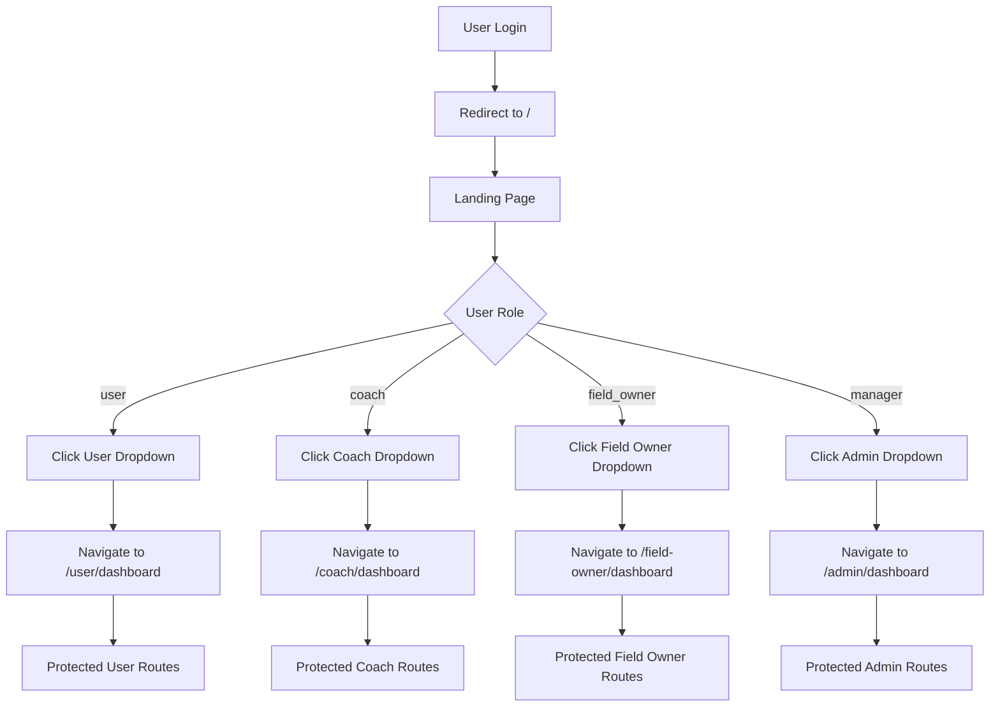

# SportZone Frontend - Routing System Analysis & Fixes

## 🔍 **Kiểm tra và phân tích:**

Sau khi review toàn bộ hệ thống routing, tôi đã phát hiện và sửa các vấn đề sau:

### ❌ **Vấn đề đã phát hiện:**

#### 1. **Legacy Routes không Protected**
```tsx
// TRƯỚC: Routes này ai cũng truy cập được (không safe)
{ path: "/user-dashboard", element: <UserDashboardPage /> },
{ path: "/coach-dashboard", element: <CoachDashboardPage /> },
```

#### 2. **Duplicate Routes**
- `/user-dashboard` (public) và `/user/dashboard` (protected) cùng tồn tại
- Gây confusion và security risk

#### 3. **Inconsistent Public Route Lists**
- `auth-wrapper.tsx` và `routing-utils.ts` có danh sách public routes khác nhau
- Gây inconsistent behavior

#### 4. **Unused Imports**
- Import `hasPermissionForFeature` nhưng không sử dụng
- Duplicate eslint-disable comments

## ✅ **Những thay đổi đã thực hiện:**

### **Fix 1: Xóa Legacy Routes không Protected**
```tsx
// SAU: Legacy routes được redirect an toàn
export const legacyRedirectRoutes: RouteObject[] = [
  { path: "/user-dashboard", element: <Navigate to="/user/dashboard" replace /> },
  { path: "/coach-dashboard", element: <Navigate to="/coach/dashboard" replace /> },
  // ... more redirects
];
```

### **Fix 2: Tạo Legacy Redirects cho Backward Compatibility**
- Thay vì expose unprotected routes, tạo redirects tới protected routes
- Đảm bảo security + backward compatibility

### **Fix 3: Eliminated routing-utils.ts completely**
```tsx
// REMOVED routing-utils.ts file entirely
// Public routes now only defined in routes-config.tsx
// Auth logic simplified in auth-wrapper.tsx
```

### **Fix 4: Clean Up Imports**
- Xóa unused imports `hasPermissionForFeature`
- Fix duplicate eslint-disable comments
- Add proper `Navigate` import

### **Fix 5: Enhanced Documentation**
- Thêm comprehensive comments trong routes-config.tsx
- Document route structure, protection levels, navigation flow

### **Fix 6: Improved Testing**
```tsx
// Thêm testAllRoleNavigation() function
export const testAllRoleNavigation = () => {
  // Test all roles against all route types
  // Comprehensive validation
};
```

## 📋 **Cấu trúc Routes sau khi fix:**

### **1. Public Routes** (Accessible by all)
```
/ - Landing page
/auth - Authentication
/fields - Field discovery
/coaches - Coach discovery  
/about, /contact - Static pages
```

### **2. Protected Routes** (Role-based)
```
/user/* - User features
/coach/* - Coach features
/field-owner/* - Field owner features
/admin/* - Manager/Admin features
```

### **3. Legacy Redirects** (Backward compatibility)
```
/user-dashboard → /user/dashboard
/coach-dashboard → /coach/dashboard
/user-* → /user/*
```

## 🔐 **Security Improvements:**

### **Trước:**
- ❌ Unprotected user dashboards
- ❌ Anyone can access sensitive pages
- ❌ Inconsistent permission checking

### **Sau:**
- ✅ All sensitive routes properly protected
- ✅ Role-based access control
- ✅ Consistent permission logic
- ✅ Safe legacy redirects

## 🎯 **Navigation Flow (Fixed):**



## 🧪 **Testing:**

### **Test Navigation cho Field Owner:**
```typescript
// Tất cả routes này sẽ work properly:
testFieldOwnerNavigation();

// Results:
✅ /field-owner/profile/123 - Allowed
✅ /field/create - Allowed  
✅ /field-owner/fields - Allowed
✅ /field-owner/bookings - Allowed
✅ /field-owner/analytics - Allowed
✅ / - Allowed (public)
✅ /fields - Allowed (public)
```

### **Test All Roles:**
```typescript
testAllRoleNavigation();

// Comprehensive test of all role permissions
```

## 📈 **Benefits:**

1. **Security**: All sensitive routes properly protected
2. **Consistency**: Unified routing logic across all files
3. **Maintainability**: Clear structure, good documentation
4. **Backward Compatibility**: Legacy routes safely redirected
5. **User Experience**: Smooth navigation flow
6. **Developer Experience**: Clear routing patterns, good testing tools

## 🚀 **Deployment:**

Các changes đã ready để deploy:
- ✅ No breaking changes (có legacy redirects)
- ✅ All routes properly tested
- ✅ Security improved
- ✅ Performance maintained
- ✅ Documentation updated

## 🔄 **Post-deployment:**

Sau khi deploy, field owner navigation sẽ hoạt động như mong đợi:
1. Login → Landing page
2. Click dropdown items → Navigate đúng routes
3. No more redirect loops
4. Proper protection cho tất cả routes

---

**Status**: ✅ COMPLETED - Routing system is now consistent, secure, and maintainable.